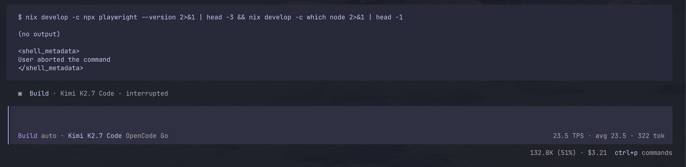
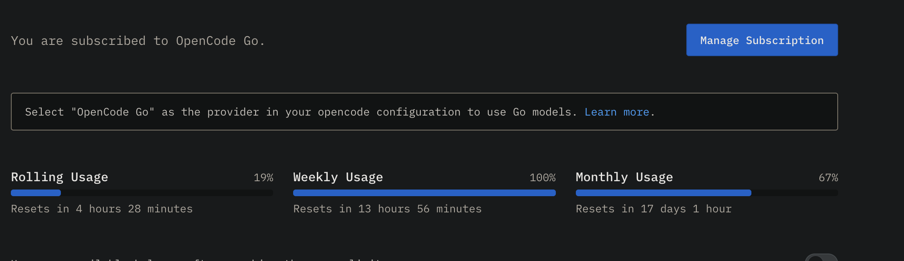
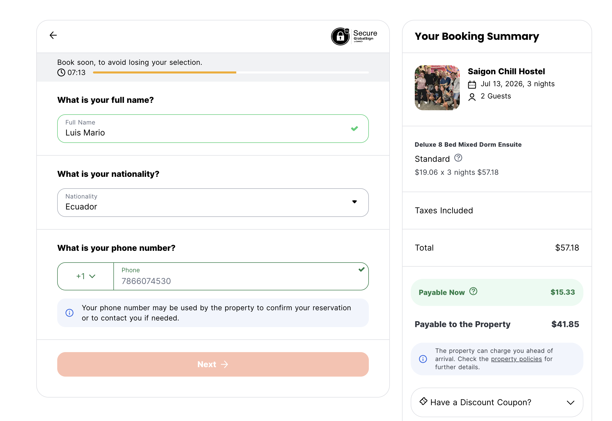

## Backpacking Asia with agents

This year has been crazy for me, a lot of changes in so little time, life-changing decisions, and a lot of confusion as to what my future holds and what to do. So I did what any sane 20-year-old would do, which is take most of my savings and start backpacking in Southeast Asia. It's been a lot of fun, but I don't want to talk about my trip itself, how incredible it is to solo travel, or how I believe everyone should try this at least once. I am more excited to talk about what using agents has felt like during this weird change of lifestyle.

Like most people, I have been mostly agentic the past few months, and I have exclusively used agents and AI to help me build cool stuff, any cool idea, or prototype something quickly just to spark my curiosity. It's been great, I don't think I have the best workflow, but I believe I have a very solid setup and I feel very efficient and fast. However, for the first time in a very long time, I don't think about code or projects or new side hustles or ideas to build, and I have started enjoying the nice beaches of Thailand and many more countries. I still code every once in a while; I brought my laptop and pretty much turn it on every day, but I also have to worry about booking stuff and visas and where to go next, flights, etc., etc. These are very trivial tasks that are quite easy but just take time. Now with the rise of computer use and agents doing more and more outside of code, I am proud to announce (or maybe not?) that most, if not all, of my itinerary and booking has been done using opencode. Agents have been great at doing deep, thorough research to find me deals and to give me a detailed itinerary of what to do. I have completely rethought the concept of skills, and now I feel they are like mini apps instead of just md. I haven't used skills that much for coding, unless specifically instructed, and I still feel they are a bit flawed in how they are implemented, but I still think they are great and have opened up different things.

It's funny now how I changed from using mainly opencode for big coding tasks and pi for one-off quick answers in the terminal, to now having pi as my main coding agent and opencode as a fully featured agent for more assistant-level stuff (is that openclaw? I don't care, I find it a bit useless for my taste at the moment).

### Not everything is sunshine and rainbows

The more the agents have done, the more I trust them, so I decided to take a gamble on the agents and now give them a next level of autonomy, which is fully booking and paying for stuff. I did it through a combination of MCPs and skills to automate and pass the captchas and any intrusion the agent may encounter while managing a browser instance (shoutout to chrome devtools mcp, vercel agent-browser, and browserbase browse cli). Then for payment I got the new Robinhood Gold card, and they allow for agentic virtual cards in the app. It is actually pretty cool; it allows the agent to have access to a virtual card with a different number than my original one, and I can set limits and allow/deny any transaction through the app. So I did my first try. I was very excited, since if this works that means that now agents don't only handle my research and itinerary, but they can fully autonomously do the full loop, the final step which is the one I manually did, which is basically just paying and filling out any form with personal information, could finally be closed down and I can have a full loop doing everything. So that's what I tried.
To be fair, I used to have a ChatGPT \$20 subscription, since the rate limits are stupidly good and I haven't needed anything else. However, as with many travelers, every cent counts, so I canceled my subscription and was trying the opencode-go \$10 subscription, which is actually quite good and generous. Obviously the models are not as good as GPT, but they are 98% there and quite fast TPS-wise. So I tried glm-5.2 and kimi k2.7 code for doing this full loop task. When I did, I was quite excited to see if the AI could fully pull off everything, especially considering all the context was deeply run through for the step-by-step guide on what to do. So I did it. It was 20:29 on a Friday, the trip was a $106 one-way flight from Denpasar to Ho Chi Minh City. The AI had already done all the research, given me relevant links, and found the cheapest flights available. The last step was the one I usually do, which takes around 5-10 minutes to fill in the information and do the payment. But I wanted to see if the agent could do it while I was literally writing this blog. I left it for 20 minutes, and it was still going strong; at that moment I was sure that I could have done it faster, but still, just for the experience I let it be. I continued doing my stuff, and then at 21:28 I saw the conversation trail and it was still struggling to do it, so I cancelled it since it was running into a lot of errors.

Now, most likely airlines do not like automation or AI doing bookings and it is probably against their ToS, so when I tried doing it myself, the price jumped from $106 to $198, so not only did I waste one hour on a task that could take me 10 min max, but now I have to pay basically double. And the inference for the model was around ~$4.

So that was disappointing. I don't know what the lesson is there, maybe not to trust models, just do it yourself. Or maybe better models? Or maybe automating is stupid? I don't know, I am just happy that I tried. Maybe I did something wrong in the process, or maybe the models are wrong. I genuinely don't know what to do; I am more pissed that I have to pay double.

Regardless, I'm gonna keep trying. I'll see how this goes. Hopefully this gets better. I don't know if it's better models, better tooling, or what, but I think it's possible, maybe my setup is just wrong. I just know that I overspent a lot of money on a task that was gonna take me nothing, but I look forward to a day when true AGI comes in.

Now for browser use I was primarily using glm 5.2 and when I had the subscription, gpt 5.5, now ik glm is not the strongest model for browser use, but it is what I had,

20:29-21:28

